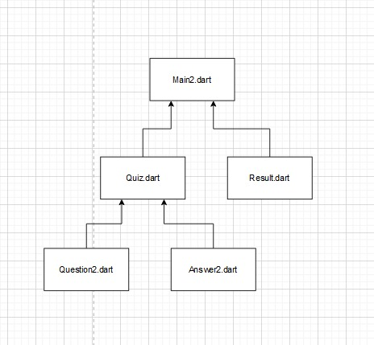
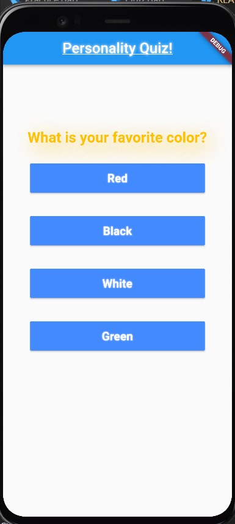
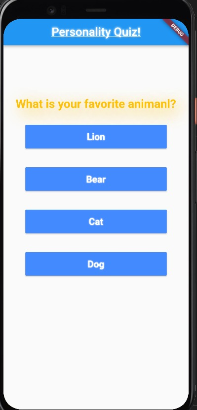
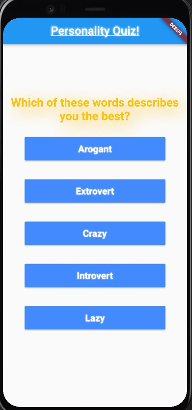
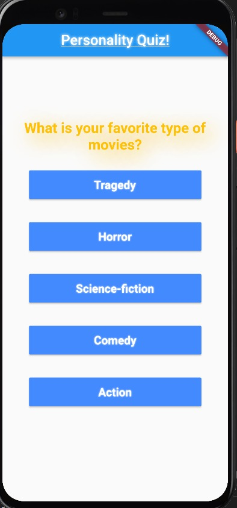
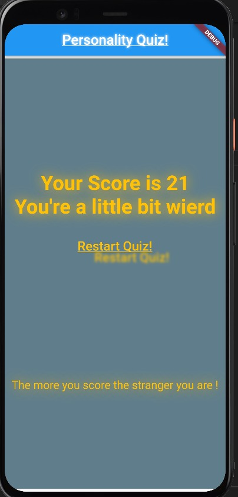

# personality_judge_app

# Table of content
* About the project 
  * built with
* Getting Started 
  * installation
  * Running
* File Structure
* ScreenShots

# About
 a simple application in which I can judge your personality depending on small choices you make !

## Built with
* Flutter
* Dart 

# Getting Started 
> The following instructions are your guide to setup the project on your device and try it.

## installation 
1. __Clone the repo__
   >$git clone https://github.com/abdelazizSalah/personality_judge_app
2. __Navigate to repo directory__
   >cd personality_judge_app
3. __Install dependencies__ 
   1. Android Studio
   2. Flutter 
   3. Dart  

## Running 
* **run the main2.dart file**

# Files Structure

# ScreenShots
*  
 -------
* 
 -------
* 
 -------
* 
 -------
* 